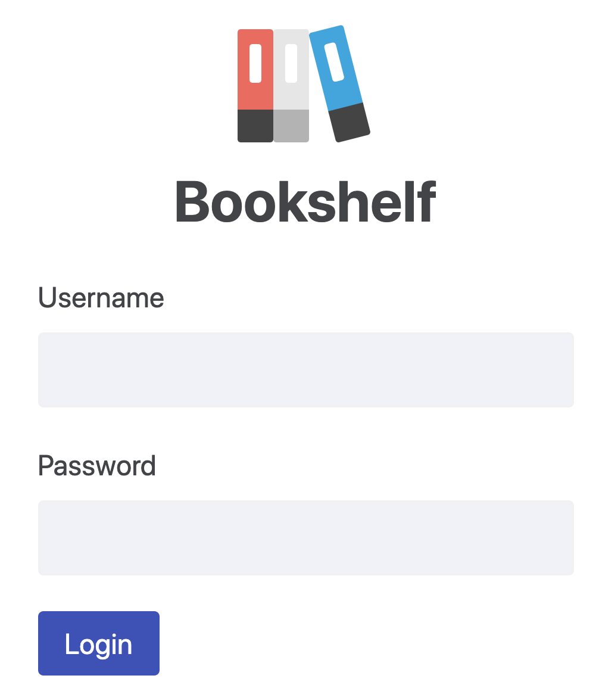

Version originale :

- [Article «Making your UI tests resilient to change» de Kent C. Dodds](https://kentcdodds.com/blog/making-your-ui-tests-resilient-to-change)

Traductions libres présentement disponibles :

- [Chinois traditionel](https://medium.com/enjoy-life-enjoy-coding/react-unit-test-%E8%AE%93%E4%BD%A0%E7%9A%84-ui-%E6%B8%AC%E8%A9%A6%E9%81%A9%E6%87%89%E8%AE%8A%E5%8C%96-%E7%BF%BB%E8%AD%AF-b9b2c1c4110f)

Vous êtes un développeur et vous voulez éviter de livrer un service de connexion qui ne
fonctionne pas. Vous écrivez donc des tests pour vous assurer que ça n'arrive pas.
Regardons ici un exemple d'un [formulaire de ce genre](https://github.com/kentcdodds/testing-workshop/blob/1938d6fc2048e55362679905f700f938a3b497c4/client/src/screens/login.js#L50-L82) :



```jsx
const form = (
  <form onSubmit={handleSubmit}>
    <div>
      <label htmlFor="username">Username</label>
      <input id="username" className="username-field" />
    </div>
    <div>
      <label htmlFor="password">Password</label>
      <input id="password" type="password" className="password-field" />
    </div>
    <div>
      <button type="submit" className="btn">
        Login
      </button>
    </div>
  </form>
)
```

Si nous avions à tester ce formulaire, nous voudrions remplir le champ « username »,
le champ « password » et ensuite soumettre le formulaire. Pour faire cela correctement,
nous aurions à rendre le formulaire et trouver les noeuds dans le document pour pouvoir
les utiliser. Voici ce que vous pourriez vouloir faire pour que cela se produise :

```js
const usernameField = rootNode.querySelector(".username-field")
const passwordField = rootNode.querySelector(".password-field")
const submitButton = rootNode.querySelector(".btn")
```

C'est ici que le problème entre en jeu. Qu'arrive-t-il lorsque l'on ajoute un autre
bouton? Que se passerait-il si l'on ajoutait un bouton « Sign up » avant le bouton
« Login »?

```jsx {12-14}
const form = (
  <form onSubmit={handleSubmit}>
    <div>
      <label htmlFor="username">Username</label>
      <input id="username" className="username-field" />
    </div>
    <div>
      <label htmlFor="password">Password</label>
      <input id="password" type="password" className="password-field" />
    </div>
    <div>
      <button type="submit" className="btn">
        Sign up
      </button>
      <button type="submit" className="btn">
        Login
      </button>
    </div>
  </form>
)
```

Et bien, ça va briser nos tests. Mais ce serait assez simple à réparer, n'est-ce pas?

```js
// changer ceci :
const submitButton = rootNode.querySelector(".btn")
// pour ceci :
const submitButton = rootNode.querySelectorAll(".btn")[1]
```

Et hop, tout est beau! Maintenant, si on commence à utiliser CSS-in-JS pour ajouter
du style à notre formulaire, et que nous n'avons plus besoin des class names `username-field` et
`password-field`, est-ce que nous devrions les supprimer? Ou bien on les garde parce que
nos tests les utilisent? Hmmm... 🤔

## Maintenant, comment est-ce que l'on écrit des sélecteurs qui sont résilients?

Sachant que
["le plus que tes tests ressemblent à la façon dont ton application est utilisée, le plus de confiance ils peuvent te donner"](https://twitter.com/kentcdodds/status/977018512689455106), ce serait intelligent de notre part de considérer le fait que nos utilisateurs se fichent de ce que sont nos class names.

Alors, imaginons que l'on a un testeur manuel dans notre équipe et qu'on lui écrit des instructions pour qu'il puisse tester la page pour nous.
Que diraient ces instructions?

1. va chercher l'élément dont le class name est `username-field`
2. ...

« Mais, comment est-ce que je peux trouver l'élément avec le class name `username-field`? »

« Ah, tu n'as qu'à ouvrir ton devtools et... »

« Mais nos utilisateurs ne feront pas ça... Pourquoi ne pourrais-je pas trouver le champ abec le libellé "username"? »

« Ah, oui, bonne idée! »

Voici pourquoi la [react-testing-library](https://testing-library.com) possède les requêtes qu'elle a. Elles vous aideront à trouver les éléments de la même façon que les utilisateurs le feraient. Ces requêtes vous permettent de trouver des éléments selon leur
[rôle](https://testing-library.com/docs/dom-testing-library/api-queries#byrole),
[libellé](https://testing-library.com/docs/dom-testing-library/api-queries#bylabeltext),
[« placeholder »](https://testing-library.com/docs/dom-testing-library/api-queries#byplaceholdertext),
[contenu textuel](https://testing-library.com/docs/dom-testing-library/api-queries#bytext),
[valeur affichée](https://testing-library.com/docs/dom-testing-library/api-queries#bydisplayvalue),
[texte alternatif](https://testing-library.com/docs/dom-testing-library/api-queries#byalttext),
[titre](https://testing-library.com/docs/dom-testing-library/api-queries#bytitle) et
[ID de test](https://testing-library.com/docs/dom-testing-library/api-queries#bytestid).

Ils sont d'ailleurs énumérés en ordre de [recommendation](https://testing-library.com/docs/guide-which-query). Il y a certainement des compromis avec ces approches, mais si vous deviez
écrire des instructions pour un testeur manuel en utilisant ces requêtes-ci, ça ressemblerait à quelque chose du genre :

1. Entre un faux username dans le champ texte libellé `username`
2. Entre un faux password dans le champ libellé `password`
3. Clique sur le bouton avec le texte `sign in`

Et cela aiderait à assurer que vous testz votre application de la manière la plus près possible de la façon dont elle est utilisée, vous donnant un test ayant une plus grande valeur.

## Qu'en est-il de la requête des `data-testid`?

Parfois, on ne peut pas sélectionner un élément par aucune autre requête. Pour ces cas-là, il est recommandé d'utiliser `data-testid` (cependant, il est important de vérifier que vous n'êtes pas en train d'oublier d'utiliser un réel attribut de `rôle` en premier lieu).

Plusieurs personnes qui rencontrent cette situation se demandent pourquoi une requête `getByClassName` n'existe pas. Ce wue je n'aime pas en utilisant les **class names** pour mes sélecteurs c'est qu'en théorie nous pensons aux noms des **class names** en fonction de leur style. Alors si on se met à ajouter un tas de **class names** qui ne sont pas pour le style, ça rend plis difficile de savoir à quoi servent ces **class names** et si nous pouvons les retirer.

Puis, si nous essayons simplement de reutiliser des **class names** que nous utilisons déjà pour le style, nous rencontrerons des problèmes comme celui du bouton ci-haut. _Si tu dois modifier ton test lors d'un refactoring ou d'un nouveau développement, c'est une indication d'un test faible_. Le réel problème c'est que la relation entre le test et le code source est trop implicite. Nous pourrions solitionner ce problème si nous faisions en sorte de **la rendre plus explicite.**

Si nous pouvions ajouter des meta données à l'élément que nous tentons de sélectionner, ça réglerait le problème. Et bien devinez quoi, il existe un API exprès! C'est les attributs `data-`! Par exemple :

```jsx
function UsernameDisplay({ user }) {
  return <strong data-testid="username">{user.username}</strong>
}
```

Et ensuite notre test pourrait faire :

```javascript
const usernameEl = getByTestId("username")
```

C'est également intéressant pour les
[tests end to end](https://github.com/kentcdodds/jest-cypress-react-babel-webpack/blob/1c842dff85cd83953e86a6f1a48653b15fb3a4d5/cypress/e2e/register.js#L20).

Alors je propose que vous l'utilisiez pour ces tests là aussi! Par contre, certaines personnes m'ont mentionné qu'ils avaient des doutes quant à mettre ces attributs en production... Si c'est vous, veuillez s'il vous plaît vous poser la question si cest réellement un problème pour vous (parce qu'honnêtement, ce n'est pas un problème aussi gros que vous le pensez). Si vous le désirez vraiment, vous pouvez retirer ces atteibuts en compilant avec [`babel-plugin-react-remove-properties`](https://www.npmjs.com/package/babel-plugin-react-remove-properties).

## Conclusion

Vous trouverez que de tester votre application d'une maniere similaire à la façon dont elle est utilisée ne rend pas seulement vos tests plus solides aux changements, mais ajouté également de la valeur pour vous. Si vous voulez en apprendre davantage à propos de ça, he vous propose de lire l'article suivant (sur le site de Kent C. Dodds) [Testing Implementation Details](/blog/testing-implementation-details).

J'espère que cet article vous aura été utile!
